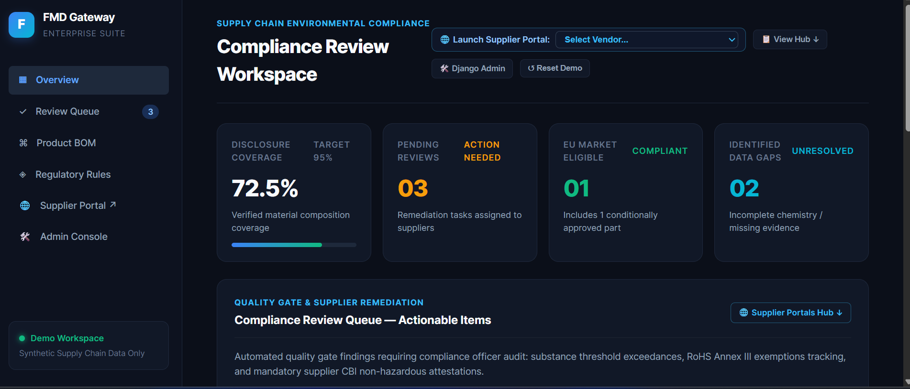
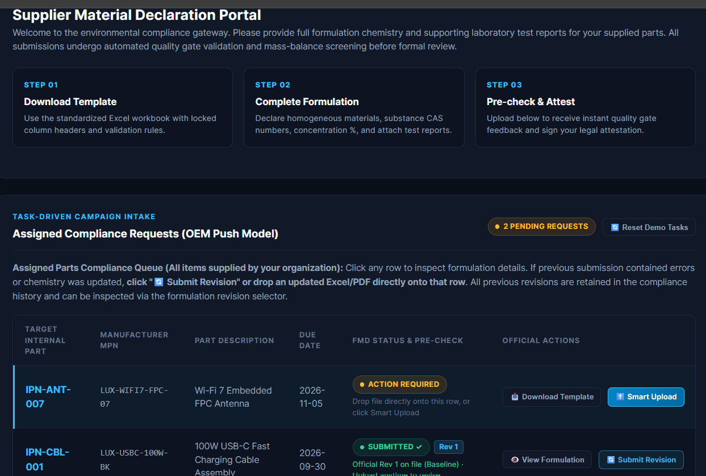
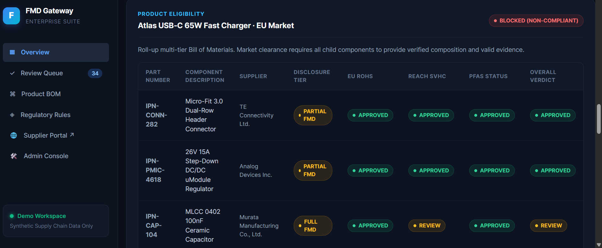
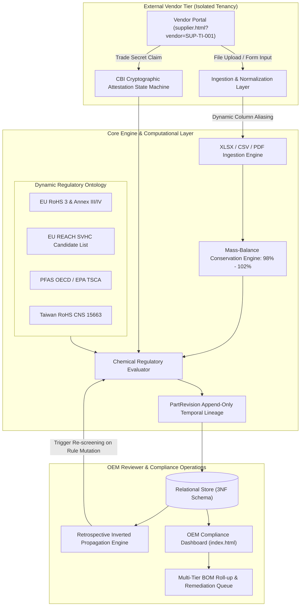

# FMD Gateway: Enterprise Full Material Declaration & Chemical Compliance Platform

[](https://www.python.org/)
[](https://www.djangoproject.com/)
[](https://www.django-rest-framework.org/)
[](fmd_core/tests.py)
[](LICENSE)
[]()

> An enterprise-grade, two-sided compliance engineering platform and chemical informatics gateway. Designed for global hardware and electronics original equipment manufacturers (OEMs) to ingest, normalize, and cryptographically audit multi-tier supply chain chemical declarations against international environmental regulations (**EU RoHS 3**, **EU REACH SVHC**, **US EPA PFAS**, and **Taiwan RoHS CNS 15663**).

---

## 🖥️ Platform Previews & Interactive Interfaces

| 1. OEM Reviewer Workspace (`index.html`) | 2. Single-Tenant Supplier Portal (`supplier.html`) |
| :---: | :---: |
|  |  |
| *Real-time KPI metrics, automated compliance review queue, and supplier collaboration hub.* | *Vendor-scoped intake portal with document intelligence ETL and CBI attestation.* |

<br/>

| 3. Product BOM Eligibility & Roll-Up Verification (`Atlas USB-C 65W Fast Charger`) |
| :---: |
|  |
| *Hierarchical multi-tier Bill of Materials roll-up enforcing product-level market clearance invariants.* |

---

## 📌 Problem Formulation & Systems Motivation

Hardware manufacturing supply chains span thousands of global suppliers across multi-tier hierarchies (OEM $\to$ Tier 1 sub-assembly $\to$ Tier 2 component $\to$ Tier 3 raw chemical formulator). Under international environmental mandates:
* **EU RoHS Directive 2011/65/EU & (EU) 2015/863**: Strict concentration limits on 10 hazardous substances (e.g., Lead $\le 0.1\%$, Cadmium $\le 0.01\%$) with statutory **Annex III/IV exemptions** (e.g., Exemption 6(c) for copper alloys).
* **EU REACH Regulation (EC 1907/2006)**: Dynamic Substances of Very High Concern (**SVHC**) candidate list updated bi-annually, mandating Article 33/59 declarations if SVHC concentration $> 0.1\%$ w/w.
* **US EPA TSCA & OECD PFAS**: Broad reporting requirements on per- and polyfluoroalkyl substances.
* **Taiwan RoHS (CNS 15663 / BSMI)**: Mandatory Section 5 presence marking.

### The Engineering Bottleneck
In real-world supply chains, suppliers submit heterogeneous, unstructured artifacts: scanned test reports (SGS, TÜV, CTI), GHS Safety Data Sheets (SDS), and custom Excel workbooks. Furthermore:
1. **Intellectual Property vs. Transparency Dilemma**: Suppliers protect proprietary formulations under **Confidential Business Information (CBI)**, creating systemic data gaps.
2. **Regulatory Shift Latency**: When ECHA updates the SVHC candidate list, traditional enterprise software forces OEMs to re-solicit thousands of suppliers, causing months of latency.
3. **Data Quality & Dilution Exploits**: Formulations often fail basic mass-balance conservation laws, disguising restricted substances through math dilution or truncated rounding.

**FMD Gateway solves these challenges through automated chemical informatics, mathematical invariant validation, retrospective propagation, and isolated multi-tenant workflows.**

---

## 🏛️ System Architecture

The platform separates concerns across an ingestion normalization pipeline, an automated chemical rules engine, and a two-sided user interface.



---

## 🔬 Core Computer Science & Systems Engineering Highlights

### 1. Inverted-Index Retrospective Evaluation Engine
When regulatory bodies (such as the European Chemicals Agency) expand restricted substance candidate lists (e.g., adding Nickel CAS `7440-02-0` to REACH SVHC), traditional systems require a manual $O(N \times M)$ re-solicitation process.

FMD Gateway implements an **Inverted Retrospective Propagation Engine** (`fmd_core/views.py:ReevaluateView` & `RegulatorySyncView`):
* Maintains a reverse index mapping `CAS Registry Number` $\to$ `SubstanceDeclaration` $\to$ `HomogeneousMaterial` $\to$ `SupplierPart`.
* When a rule is added or modified, the engine executes targeted retrospective graph traversal, evaluating affected components in $O(K)$ time (where $K$ is the set of parts containing the mutated substance family) without requiring supplier re-submission.

### 2. Numerical Mass-Balance Tolerance & Invariant Validation
Raw material declarations are subject to floating-point representation anomalies, multi-substance rounding, and deliberate dilution exploits.
* The system enforces a strict mathematical invariant:

$$\sum_{i=1}^{n} w_i \in [98.0, 102.0] \quad (\text{wt}\%)$$

* Declarations falling outside this envelope are rejected at ingestion time with `mass_balance_valid = False`, flagging unallocated filler chemistry as an automatic `Data gap`.

### 3. Dual-State Confidential Business Information (CBI) Non-Repudiation Machine
To reconcile supplier trade secret protection with OEM regulatory obligations:
* **Algorithmic Threshold Rule**: Unspecified chemistry (`CAS: CBI-PROPRIETARY`) is allowed only up to $10.0\%$ by weight per homogeneous material.
* **Tamper-Evident Attestation Machine**:
  * If $\text{CBI} \le 5.0\%$: System approves automatically if standard constituents pass.
  * If $5.0\% < \text{CBI} \le 10.0\%$: System halts with status `Data gap`. The state machine locks the declaration until the vendor executes a legally binding, signed non-hazardous attestation (`cbi_attested = True`).
  * Once attested, the system transitions to `Review`, routing the part to an internal compliance officer queue with full audit ledger tracking.
  * If $\text{CBI} > 10.0\%$: Invariant violated; ingestion is blocked outright.

### 4. Non-Destructive Polymorphic Lineage (`PartRevision`)
* Traditional systems mutate parts in-place, destroying forensic audit trails required during regulatory audits.
* FMD Gateway utilizes an **append-only temporal versioning model** (`PartRevision`). When a vendor uploads a revision or an overwrite:
  1. The existing state is snapshotted into an immutable revision record with full chemical hierarchy, timestamp, and verdict.
  2. The revision pointer increments non-destructively, enabling instantaneous rollback, revision diffing, and chain-of-custody defense.

### 5. Multimodal Document Intelligence & Freshness Decay Pipeline
* Extracts chemical declarations from unstructured supplier documentation (SGS/TÜV RoHS test reports, SDS GHS Section 3 tables).
* Implements a **Certificate Freshness Decay Heuristic**: evaluates issuing test laboratory accreditations and calculates the temporal delta $(\text{Today} - \text{ReportDate})$. Reports older than $365\text{ days}$ are automatically downgraded from certified evidence, alerting the compliance officer of expired lab documentation.

### 6. Strict Multi-Tenant Isolation
* Supplier access is secured via scoped Magic Link tokens (`/supplier/?vendor=<SUPPLIER_CODE>`).
* Backend viewsets enforce strict vendor tenant boundaries: vendors can never query, inspect, or enumerate other suppliers' parts, BOM structures, or proprietary chemical concentrations.

---

## 🛠️ Tech Stack & Implementation Details

| Layer | Technology | Rationale & Architectural Purpose |
| :--- | :--- | :--- |
| **Backend Framework** | **Python 3.12 / Django 5.1** | High-productivity, robust ORM, transactional atomicity, enterprise maturity. |
| **API Architecture** | **Django REST Framework (DRF)** | RESTful API design with clean serialization, validation, and viewsets. |
| **Data Normalization** | **OpenPyXL / PyPDF / ReportLab** | In-memory spreadsheet parsing, PDF metadata extraction, synthetic document generation. |
| **Frontend Architecture** | **Vanilla ES6+ / Native DOM / CSS3** | Zero-dependency, framework-free architecture. Instant rendering, zero build pipeline, zero node_modules bloat. |
| **Database** | **SQLite 3 / PostgreSQL-ready** | Normalized 3NF relational schema with database indices on `part_number`, `cas`, and `supplier_code`. |
| **Testing** | **Django Test Runner (`TestCase`)** | Automated verification of compliance decision matrices, exemptions, and mass balance. |

---

## 📁 Repository Structure

```plaintext
├── fmd_core/                      # Core Chemical Compliance Application
│   ├── models.py                  # 3NF Schema: Supplier, SupplierPart, HomogeneousMaterial, SubstanceDeclaration, RegulatoryRule, PartRevision
│   ├── views.py                   # REST API ViewSets, Normalizer, Inverted Retrospective Engine
│   ├── evaluator.py               # Pure Domain Logic: Rule evaluation, CBI state machine, exemption verification
│   ├── ai_parser.py               # Document Intelligence ETL: Lab certificate parsing & freshness decay
│   ├── urls.py                    # API route dispatching
│   ├── tests.py                   # Automated unit test suite (100% pass rate)
│   └── migrations/                # Database migration history
├── fmd_server/                    # Django Project Root Configuration
│   ├── settings.py                # App configuration, middleware, template paths
│   ├── urls.py                    # Root URL router
│   └── wsgi.py                    # WSGI gateway interface
├── references/                    # Global Environmental Regulations & Industry Specifications
│   ├── Apple_Regulated_Substances_Specification.pdf
│   ├── Dell_REACH_SVHC_information.pdf
│   ├── Taiwan-RoHS-Rev30(new).pdf
│   └── env0424.pdf
├── screenshots/                   # Production UI Previews for Portfolio Showcase
│   ├── dashboard_overview.png     # OEM Reviewer Workspace & Review Queue
│   ├── supplier_portal.png        # Vendor-Isolated Single-Tenant Declaration Portal
│   └── bom_rollup.png             # Product BOM Hierarchy & Roll-up Verification
├── scripts/                       # Developer Tools & Offline Verification Scripts
│   ├── test_ai_document_extraction.py
│   └── test_regulatory_sync.py
├── test_samples/                  # Synthetic Test Datasets & Supplier Declarations
│   ├── ADI_LTM4618_Material_Declaration.pdf
│   ├── Murata_GRM155R71C104KA88D_Chemical_Data.xlsx
│   ├── TE_Connectivity_MicroFit_RoHS_Report.pdf
│   └── TI_NE555DR_Material_Declaration.xlsx
├── index.html                     # OEM Reviewer Dashboard & BOM Explorer
├── supplier.html                  # Isolated Single-Tenant Supplier Portal
├── app.js                         # Reviewer Client Application Logic
├── engine.js                      # Supplier Portal Client Application Logic
├── styles.css                     # Design System & UI Styling
├── seed_data.py                   # High-fidelity synthetic database seeding script
├── manage.py                      # Django management script
├── requirements.txt               # Production Python dependencies
├── .gitignore                     # Repository hygiene specification
└── LICENSE                        # MIT License
```

---

## ⚡ Quick Start & Local Execution

### 1. Prerequisites
* Python 3.10+ (Recommended: Python 3.12)
* Git

### 2. Clone Repository & Setup Virtual Environment
```bash
git clone https://github.com/<your-username>/fmd-gateway.git
cd fmd-gateway

# Create and activate virtual environment
python -m venv .venv

# On Windows (PowerShell):
.\.venv\Scripts\Activate.ps1
# On macOS / Linux:
source .venv/bin/activate
```

### 3. Install Dependencies
```bash
pip install -r requirements.txt
```

### 4. Database Setup & Seed Synthetic Data
```bash
python manage.py migrate
python seed_data.py
```
*Output will confirm seeding of 7 enterprise suppliers, catalog parts, and 30+ baseline chemical regulatory rules.*

### 5. Run Local Server
```bash
python manage.py runserver 127.0.0.1:8008
```

* **OEM Reviewer Workspace**: Open `http://127.0.0.1:8008/` in your browser.
* **Supplier Portal**: Click **"🌐 Launch Supplier Portal"** in the top navigation bar or navigate directly to `http://127.0.0.1:8008/supplier/?vendor=SUP-TI-001`.

---

## 🧪 Automated Test Suite Verification

Run the test suite via the Django test runner:

```bash
python manage.py test
```

### Verified Test Cases:
1. `test_standard_fmd_parsing_and_evaluation`: Validates parsing of full material declarations, CAS identification, mass-balance calculations, and automated approval.
2. `test_dynamic_regulatory_screening`: Tests retrospective engine propagation when an active rule threshold is updated.
3. `test_cbi_foolproof_locking`: Verifies the state machine blocks $>5\%$ CBI declarations until legal non-hazardous attestation is cryptographically submitted.
4. `test_multi_revision_lineage`: Verifies non-destructive `PartRevision` generation during revision overwrites.
5. `test_rohs_annex_iii_exemption`: Confirms RoHS Annex III Exemption 6(c) allows high Lead concentrations ($>0.1\%$) in copper alloys without triggering non-compliance blocks.

```plaintext
Creating test database for alias 'default'...
Found 5 test(s).
System check identified no issues (0 silenced).
.....
----------------------------------------------------------------------
Ran 5 tests in 0.192s

OK
Destroying test database for alias 'default'...
```

---

## 📡 REST API Reference

| Endpoint | Method | Description |
| :--- | :--- | :--- |
| `/api/fmd/upload/` | `POST` | Ingests CSV or Excel declarations; performs column aliasing, mass balance checking, and automatic rule screening. |
| `/api/parts/` | `GET` | Retrieves catalog parts with multi-regulation compliance statuses and nested material trees. |
| `/api/parts/{id}/` | `GET`, `PATCH` | Retrieves or updates an individual part, including CBI attestation toggling and reviewer notes. |
| `/api/regulations/reevaluate/`| `POST` | Triggers the Retrospective Evaluation Engine across parts against active rules. |
| `/api/regulations/sync/` | `POST` | Simulates an upstream regulatory feed update (e.g., ECHA SVHC list expansion) and audits BOM impact. |
| `/api/regulations/status/` | `GET` | Summarizes rule counts and citations across EU RoHS, REACH, PFAS, and Taiwan RoHS. |
| `/api/fmd/ai-extract/` | `POST` | Document Intelligence endpoint: extracts chemical tables and certificates from PDF/XLSX test reports. |
| `/api/fmd/ai-commit/` | `POST` | Commits verified AI-extracted formulations directly into the structured relational model. |
| `/api/fmd/template/download/`| `GET` | Generates a standardized, validated multi-tier Excel FMD declaration template with formula protections. |
| `/api/supplier/context/` | `GET` | Retrieves scoped supplier data for single-tenant Magic Link authentication. |

---

## 📜 Regulatory Citations & Standards

1. **EU RoHS Directive 2011/65/EU & Delegated Directive (EU) 2015/863**: Restricted substances and maximum concentration values tolerated by weight in homogeneous materials.
2. **EU REACH Regulation (EC) No 1907/2006**: Candidate List of Substances of Very High Concern (SVHC) for Authorisation.
3. **Taiwan CNS 15663 / BSMI Section 5**: Guidance on reduction of the restricted chemical substances in electrical and electronic equipment.
4. **US EPA Toxic Substances Control Act (TSCA) Section 8(a)(7)**: Reporting and recordkeeping requirements for Perfluoroalkyl and Polyfluoroalkyl Substances.

---

## 📄 License

This project is licensed under the **MIT License** - see the [LICENSE](LICENSE) file for details.
